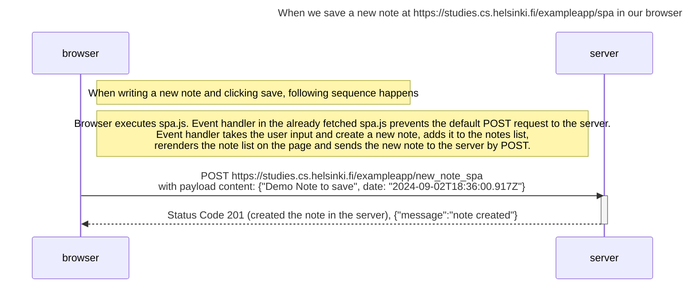

```mermaid
sequenceDiagram
    title When we save a new note at https://studies.cs.helsinki.fi/exampleapp/spa in our browser
    
    participant browser
    participant server

    Note right of browser: When writing a new note and clicking save, following sequence happens

    Note right of browser: Browser executes spa.js. Event handler in the already fetched spa.js prevents the default POST request to the server. <br/> Event handler takes the user input and create a new note, adds it to the notes list, <br/>rerenders the note list on the page and sends the new note to the server by POST.
    browser->>server: POST https://studies.cs.helsinki.fi/exampleapp/new_note_spa <br/> with payload content: {"Demo Note to save", date: "2024-09-02T18:36:00.917Z"} 
    activate server
    server-->>browser: Status Code 201 (created the note in the server), {"message":"note created"}
    deactivate server
```